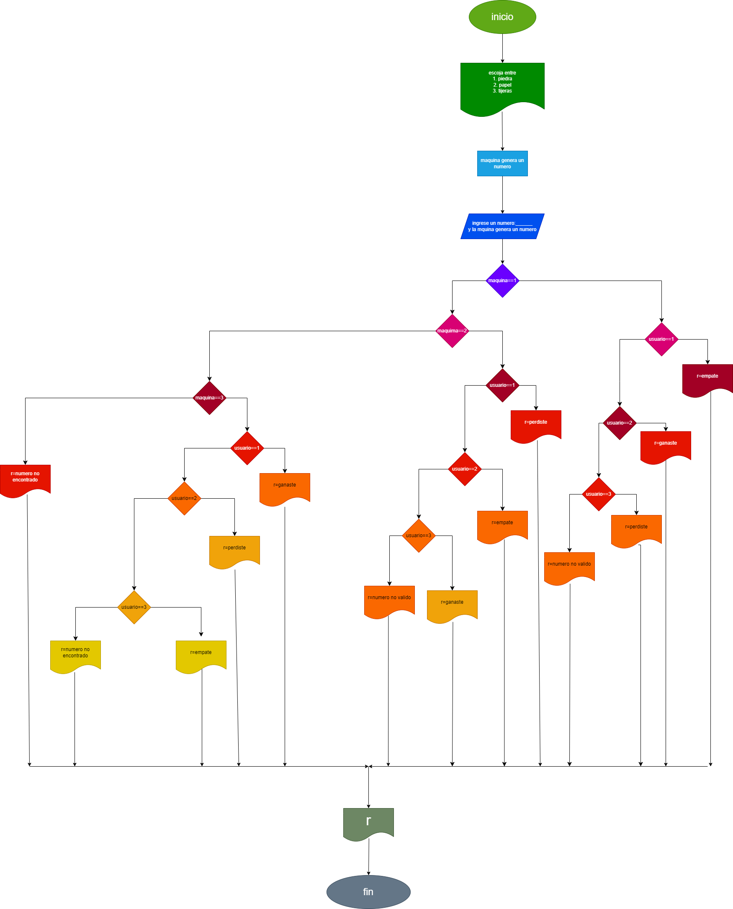

# Piedra_Papel_Tijeras
un juego de piedra papel o tijeras

## juego de piedra papel o tijeras

ingresa un numero
- 1=piedra
- 2=papel
- 3=tijeras
- si pone otro numero el progama no funcionara

al tu escojer un numerola maquina ya tendra el numero seleccionado al azar

# analisis

## input

### numero de entrada

n=numero del objeto elcual tu seleccionaste
z=numero escojidoal azar por la maquina

### prossesing
- n==z
empate

- n=1 and z=2
perdiste

- n=1 and z=3
ganaste

- n=2 and z=1 
ganaste

- n=2 and z=3
perdiste

- n=3 and z=1
perdiste

- n=3 and z=2
ganaste

# diseño

# construction